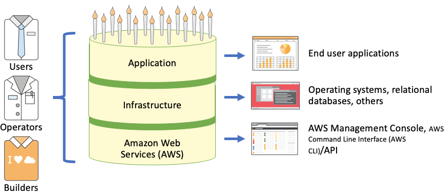
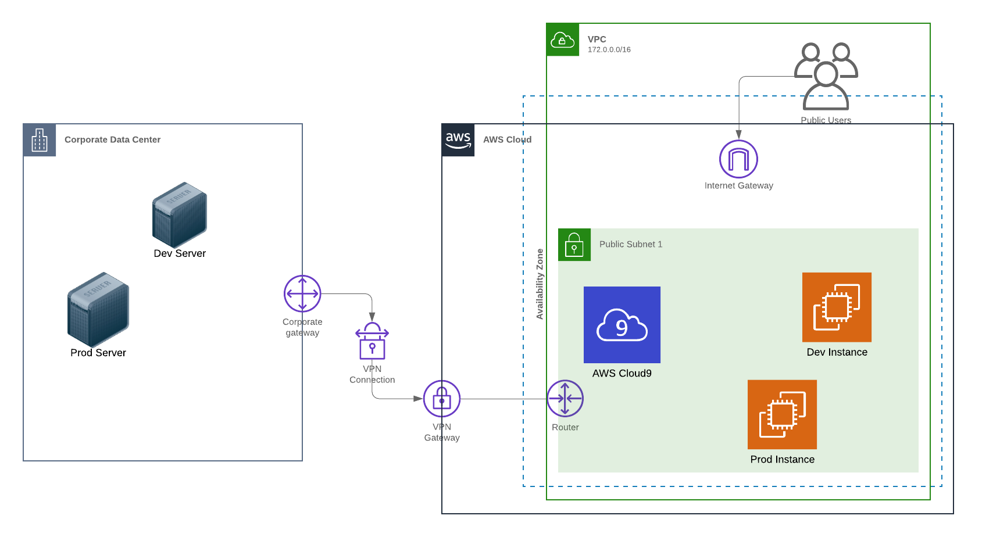

# Overview

Identity in AWS includes providing authentication, authorization, audit and governance for your cloud workloads. Identity services in AWS include Amazon Cognito for Application Identity and AWS Identity and Access Management (IAM) for AWS Management Console, Command Line Interface (CLI) access and Infrastructure Identity. Infrastructure identity includes access to operating systems, relational databases and containers.  This workshop focuses on infrastructure identity where you can utilize IAM Users, Roles and Policies to grant access to infrastructure such as EC2, RDS and ECS.

This workshop is designed to help you get familiar with AWS Security services and learn how to use them to securely administer systems in your environment.  You'll be working with services such as AWS Systems Manager Session Manager, Amazon EC2 Instance Connect, and AWS Identity and Access Management. You will learn how to use these services to securely connect and administer your Amazon EC2 Instances as well as systems on-premises, you will setup tagged based access, and configure logging which will enable auditing of administrative activities and improve the security posture of your environment.

* **Level**: Intermediate
* **Duration**: 2 hours
* **<a href="https://www.nist.gov/cyberframework/online-learning/components-framework" target="_blank">CSF Functions</a>**: Protect and Detect
* **<a href="https://d0.awsstatic.com/whitepapers/AWS_CAF_Security_Perspective.pdf" target="_blank">CAF Components</a>**: Preventative, Detective
* **<a href="https://awssecworkshops.com/getting-started/" target="_blank">Prerequisites</a href>**: AWS Account, Admin IAM User

## Scenario

Your company is new to the cloud and has deployed their first set of development and productions systems in AWS, additionally you still have hosts to manage in your data center.  You are a systems administrator and have been tasked with setting up secure administrative access to your systems in AWS and on-premises.  As part of that configuration you are also responsible for confirming that you can audit administrative activities. Security has found that ssh keys are not properly secured and is asking for a better solution that includes EC2 Instances in AWS and on-premises systems. Your security team has asked if there is way to centrally manage administrative access to systems and have full audit capabilities.

## Architecture

In the first module we launch 4 instances in the us-east-1 region, 2 instances will be your EC2 instances, the other 2 instances will be mock on-premises systems. Additionally, we will be build a Cloud9 IDE environment and use this as our workspace for the workshop. <a href=https://aws.amazon.com/cloud9  target="_blank">AWS Cloud9</a> is a cloud-based integrated development environment (IDE) that lets you write, run, and debug your code with just a browser. It includes a code editor, debugger, and terminal. Cloud9 comes pre-packaged with essential tools for popular programming languages and the AWS Command Line Interface (CLI) pre-installed so you don’t need to install files or configure your laptop for this workshop.

## Presentation deck
[Workshop Presentation Deck](./infrastructure-identity-workshop-presentation.pdf)

## Region
Please use the **us-east-1(N. Virginia)** region for this workshop.

## Modules

This workshop is broken up into the four modules below:

1. [Environment setup](./01-environment-setup.md)
2. [Session Manager](./02-using-AWS-Systems-Manager-Session-Manager.md)
3. [EC2-Instance-Connect](./03-using-EC2-Instance-Connect.md)
4. [Clean-up](./04-cleanup.md)
